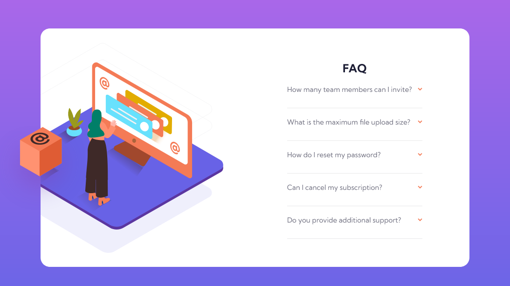

# Frontend Mentor - FAQ accordion card solution

This is a solution to the [FAQ accordion card challenge on Frontend Mentor](https://www.frontendmentor.io/challenges/faq-accordion-card-XlyjD0Oam). Frontend Mentor challenges help you improve your coding skills by building realistic projects.

## Table of contents

- [Overview](#overview)
  - [The challenge](#the-challenge)
  - [Screenshot](#screenshot)
  - [Links](#links)
  - [Built with](#built-with)
  - [What I learned](#what-i-learned)
  - [Continued development](#continued-development)
  - [Useful resources](#useful-resources)
- [Author](#author)

**Note: Delete this note and update the table of contents based on what sections you keep.**

## Overview

Welcome to the 'FAQ Accordion Card' coding challenge hosted on FrontendMentor. This challenge has been categorized as suitable for individuals at the 'NEWBIE' level, providing an excellent opportunity to enhance one's proficiency in HTML, CSS, and JavaScript.

### The challenge

Users should be able to:

- View the optimal layout for the component depending on their device's screen size
- See hover states for all interactive elements on the page
- Hide/Show the answer to a question when the question is clicked

### Screenshot

### Links

- Solution URL: [Add solution URL here](https://your-solution-url.com)
- Live Site URL: [Live site](https://faq-accordion-card-hakin04.netlify.app/)

### Built with

- Semantic HTML5 markup
- CSS custom properties
- Flexbox
- CSS Grid
- Vanilla JS

### What I learned

- The hidden difference between px, rem, em, and %
- A better approach to tackling frontend web development challenges (Youtube link in ###useful resources).
- A better-by-far method of how to display accordion answers using max-Height trick instead of toggling the display values.
- An eye-opening beginner-friendly knowledge on how to use svg.

Use this section to recap over some of your major learnings while working through this project. Writing these out and providing code samples of areas you want to highlight is a great way to reinforce your own knowledge.

### Continued development

- AREAS TO FOCUS ON IN FUTURE PROJECTS
  In future projects, i want to put a laser focus on utilising the difference between px, rem, em and % to develop a full functioning website

Also, I want to explore more use cases of SVGs

### Useful resources

- [Resource: Youtube-Coder Coder](https://youtu.be/FboXxLxg8eo?si=oFYQgvnjGKxjSQu8) - This gave me a refined approach on how to approach frontend web development chaallenges.

## Author

- Frontend Mentor - [@Akinyemi4](https://www.frontendmentor.io/profile/Akinyemi4)
- Twitter - [@Akinyemi004](https://twitter.com/home)
